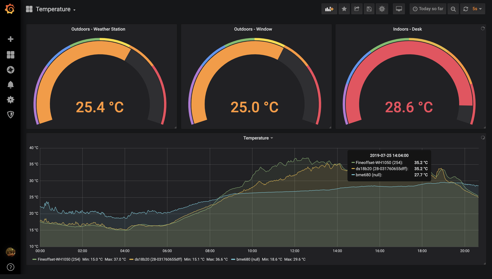

# Grafana Dashboards

## Introduction

This repository contains exports of Grafana dashboards I've created.

**These dashboards are more for reference than actual use**, as they are configured to work with the specific setups that I am using.

## Usage

### Importing

The JSON files in this repository can be imported into a Grafana instance by using the [Import](https://grafana.com/docs/reference/export_import/#importing-a-dashboard) function.

> Dashboards will need to be configured to connect to a datasource. Review the configuration of panels to see what type of data / datasource is required.

### Exporting

Use Grafana's [Export](https://grafana.com/docs/reference/export_import/#exporting-a-dashboard) function to create JSON exports of dashboards. When exporting enable the `Export for sharing externally` option and choose `Save to file`. Avoid exporting and copying to the clipboard, as some editors will re-format the file. Rename the exported file to the name of the dashboard.

If the dashboard is new to the repository: add the file to the repository, update this readme with the dashboard and commit.

If the dashboard already exists in the repository and is being updated: overwrite the existing file in the repository, update this readme if neccessary and commit.

## Dashboard Overviews

### **Temperature** ([Temperature.json](Temperature.json))

The Temperature dashboard shows details of temperatures measured from different sensors. The data is queried from an Influx database.

